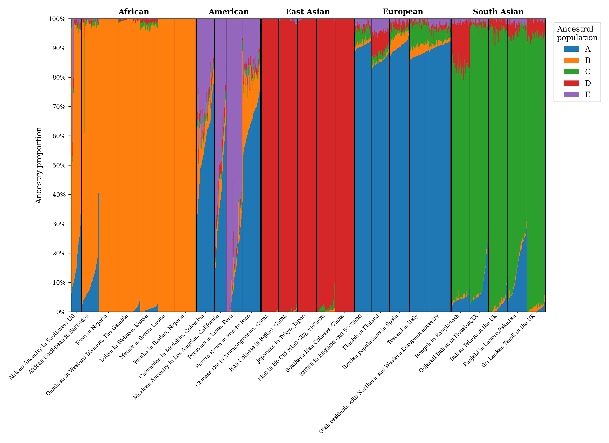
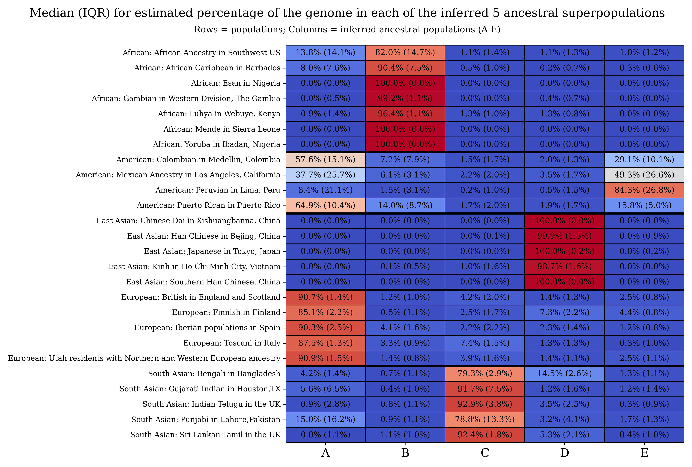

# Ancestry Cluster Pipeline (ADMIXTURE + 1000 Genomes)

This repo is a Dockerized pipeline that runs **ADMIXTURE** on the **1000 Genomes Project** dataset to infer **5 ancestral “super-population” clusters** from genetic data.


---

## What tool are we using?

We use **ADMIXTURE** (model-based ancestry estimation / clustering):

- Project page: https://dalexander.github.io/admixture/
- Manual (PDF): https://dalexander.github.io/admixture/admixture-manual.pdf

**Citation (please use this when referencing the method):**  
D.H. Alexander, J. Novembre, and K. Lange. *Fast model-based estimation of ancestry in unrelated individuals.* **Genome Research**, 19:1655–1664, 2009.

---

## What are we doing? (Unsupervised clustering, very explicitly)

We run **UNSUPERVISED** ADMIXTURE on 1000 Genomes.

**Unsupervised means:**
- **ADMIXTURE is NOT given population labels** (e.g., AFR/EUR/EAS/SAS/AMR) for any individual.
- It only sees **genotypes** (genetic data) and a chosen number of clusters **K** (here **K=5**).
- It learns **5 clusters purely from genetic variation**, by fitting a statistical model.

**Only after ADMIXTURE finishes**, we download 1000G population metadata (`samples.txt`, `populations.tsv`, `superpopulations.tsv`) and then:
- **post hoc** compare the inferred clusters to known the self-reported race / regions of origin of the 1000 Genomes participants. 

So: **the algorithm “discovers” 5 natural clusters / ancestral populations**; we **interpret** them afterward.

---

## How ADMIXTURE works (high level)

ADMIXTURE fits a model where each individual’s genome is a mixture of **K ancestral populations**.

It estimates two key outputs:

### 1) The `Q` file (`global.5.Q`) — individual ancestry proportions
- Shape: **N individuals × K clusters**
- Each row sums to ~1
- Entry `Q[i,k]` is the **estimated fraction of individual *i*’s genome** assigned to ancestral cluster *k*

### 2) The `P` file (`global.5.P`) — ancestral allele frequencies
- Conceptually: **K clusters × M SNPs**
- `P[k, m]` is the **estimated allele frequency** at SNP *m* in ancestral cluster *k*

Internally, ADMIXTURE iteratively updates:
- **ancestry proportions per individual** (Q)
- **allele frequencies per cluster** (P)

…to maximize the likelihood of the observed genotypes under the model.

---

## Why “super-populations” and what we do with them

With **K=5**, we typically observe components that (when inspected after the fact) align closely with the five 1000G “super-population” groupings:

- AFR (African)
- EUR (European)
- EAS (East Asian)
- SAS (South Asian)
- AMR (Admixed American)

Important nuance:
- ADMIXTURE does **not** know these labels.
- We infer components **first**, then **compare** to known labels **afterward**.

### Projection mode (how you use this on new people)
Once you’ve inferred allele frequencies (**the `P` file**) on a reference panel (here: 1000G), you can use ADMIXTURE **projection mode** (`--project`) to estimate ancestry proportions (**a `Q` file**) for **new individuals**, while keeping the inferred ancestral allele frequencies fixed.

Practical takeaway:
- **Train** on 1000G → learn **`P`**
- **Project** new genotypes → compute **`Q`** percentages for each individual

---

## What the included plots show

This repo includes example PDFs produced by `analyze_clusters.py`:

### Estimated cluster assignment (ancestry) of individual 
This stacked-bar plot shows:
- **every individual** (one vertical bar per person)
- ancestry proportions across the 5 inferred components
- individuals are ordered by superpopulation/population labels **only for visualization** (labels are applied after inference)




### Median + IQR ancestry fraction by population (summary view)
This heatmap summarizes ancestry percentages **per population**:
- Each cell shows **median (IQR)** for the **estimated %** ancestry component
- Rows are labeled by `Superpopulation: Population`
- Columns are the **inferred** ancestral components (A–E)




---

## SNP set: “high quality SNPs” (and how flexible this is)

In this pipeline, `high_quality_snps.txt` is intended to represent an **intersection** of:
1. The SBayesRC ~7M SNP set: https://github.com/zhilizheng/SBayesRC  
2. The UK Biobank PCA SNPs map: https://biobank.ctsu.ox.ac.uk/ukb/ukb/auxdata/snp_pca_map.txt  
3. SNPs present in the 1000 Genomes dataset used here

That intersection is convenient because it creates a SNP set that:
- overlaps common downstream resources (UKB, PRS/PCA workflows, etc.)
- is broadly well-behaved and widely used

That said: **ADMIXTURE does not require these exact SNPs.**  
You can use *almost any* SNP set as long as you:
- sample SNPs roughly uniformly across the **autosomes (chr 1–22)**
- apply basic QC
- ideally do **LD pruning** (this pipeline does)

---

## Runtime and resource expectations

On a typical modern workstation:
- **Runtime:** expect **~1 hour** end-to-end (network + compute)
- **Threads:** uses up to **6 threads** (`--threads 6`, `admixture -j6`)
- **Memory:** plan for **~20 GB RAM** available (PLINK steps request up to 20,000 MB)
- **Storage:** plan for **~10+ GB free disk** (downloads + intermediates + outputs)

Network speed matters a lot because the input genotype download is large.

---

## Repo contents

- `cluster.sh`  
  Downloads data, filters/QCs SNPs, LD prunes, runs ADMIXTURE (K=5), downloads labels *after* clustering, then runs analysis.

- `analyze_clusters.py`  
  Loads `global.5.Q` (Q), joins 1000G population/superpopulation metadata, and generates the two PDFs shown above.

- `high_quality_snps.txt`  
  SNP list used for extraction prior to QC + LD pruning.

- `Dockerfile`  
  Builds a runnable environment with PLINK2 + ADMIXTURE + Python dependencies.

---

## Quick start (recommended)

1. Pull the image:
   ```bash
   docker pull ghcr.io/brobdingrag/ancestry-cluster:latest
````

2. Run (writes outputs into `./data` on your host):

   ```bash
   docker run --rm -it -v "$PWD:/work" ghcr.io/brobdingrag/ancestry-cluster:latest
   ```

---

## Outputs

After a successful run, you should have:

* `data/global.5.Q` — **ancestry proportions per individual** (Q)
* `data/global.5.P` — **ancestral allele frequencies** (P)

The analysis script also produces:

* `median_iqr_each_population.pdf`
* `ancestry_fraction_each_individual.pdf`

(Depending on how you run/mount volumes, these PDFs may appear in your working directory or alongside the script outputs.)

---

## Troubleshooting

* **AVX2 error from PLINK2**
  If your CPU doesn’t support AVX2, rebuild using the non-AVX2 PLINK2 build:

  ```bash
  docker build \
    --build-arg PLINK2_ZIP_URL="https://s3.amazonaws.com/plink2-assets/plink2_linux_x86_64_20251205.zip" \
    -t ghcr.io/brobdingrag/ancestry-cluster:latest .
  ```

* **Dropbox downloads return HTML**
  If `wget` fetches HTML instead of the file, add `?dl=1` to the end of Dropbox links.

* **Want different K?**
  Change:

  ```bash
  admixture -j6 --seed=12345 global.bed 5
  ```

  to another K, and update the analysis accordingly.

---

## Notes on interpretation

These outputs are best thought of as **statistical ancestry components** inferred from the dataset and model assumptions.
They are often highly informative and align well with known population structure, but:

* components can shift with SNP choice, LD pruning, sample composition, and K
* “labels” like AFR/EUR/etc. are **interpretations applied after inference**, not something the model was told

---

## Contact

For issues or suggestions, open a GitHub issue in this repo.

